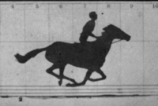
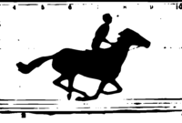
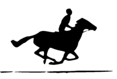
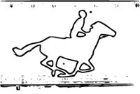
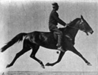
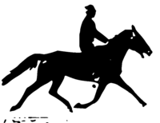
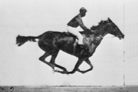
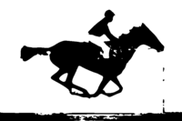
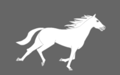
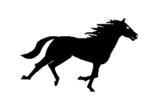

# Horses in Motion

This project creates animated GIFs of horses in motion using photographs by [Eadweard Muybridge](https://en.wikipedia.org/wiki/Eadweard_Muybridge). The output GIF files consist of bilevel images so that they can be shown in quick succession on an e-paper display using the animation (A2) *waveform* mode, which works only with pure black and white pixels.

## Background

The source files are taken from the following pages on Wikimedia Commons.

* [The_Horse_in_Motion-anim.gif](https://commons.wikimedia.org/wiki/File:The_Horse_in_Motion-anim.gif) – Muybridge's *The Horse in Motion*, 1878. Animation by [Nevit Dilmen](https://commons.wikimedia.org/wiki/User:Nevit).
* [Muybridge_horse_pacing_animated.gif](https://commons.wikimedia.org/wiki/File:Muybridge_horse_pacing_animated.gif) – Animated sequence of a horse pacing, by [Waugsberg](https://commons.wikimedia.org/wiki/User:Waugsberg).
* [Muybridge_race_horse_animated.gif](https://commons.wikimedia.org/wiki/File:Muybridge_race_horse_animated.gif) – Animated sequence of a race horse galloping, by [Waugsberg](https://commons.wikimedia.org/wiki/User:Waugsberg).
* [Horse_gif.gif](https://commons.wikimedia.org/wiki/File:Horse_gif.gif) – Animation made by rotoscoping a horse's gallop, by Lennart Rikk.

## Licenses

All of the source animations from Wikimedia Commons are in the public domain. The other content of this project is licensed under the [GNU General Public License v3.0](https://choosealicense.com/licenses/gpl-3.0/).

The animated GIF files produced by this project are licensed under the [Creative Commons Attribution Share Alike 4.0 International](https://choosealicense.com/licenses/cc-by-sa-4.0/) license.

## Building

The [Makefile](Makefile) requires the following programs on your PATH environment variable.

* **convert** – converts between image formats and edits images (from *ImageMagick*)
* **mkbitmap** – transforms images into bitmaps with scaling and filtering (from *potrace*)
* **potrace** – transforms bitmaps into vector graphics (from *potrace*)
* **inkscape** – an SVG editing program (from *Inkscape*)

## Images

This project creates the following animated GIF files. To see how the hand-edited frames were created, open the [SVG source file](src/horse-anim.svg) in Inkscape, which will display the off-page images along with the image framed by the page.

* **horse-motion.gif** – traced with *potrace*
* **horse-motion-cutoff.gif** – created in *Inkscape* using the brightness cutoff mode of the Trace Bitmap tool
* **horse-motion-edge.gif** – created in *Inkscape* using the edge detection mode of the Trace Bitmap tool
* **horse-pacing.gif** – traced with *potrace*
* **horse-racing.gif** – traced with *potrace*
* **horse-traced.gif** – traced with *potrace* from a threshold cutoff bitmap
* **horse-traced-cutoff.gif** – a threshold cutoff bitmap

A single frame from each of the original animations is converted as illustrated below. The *Vector* column shows the rasterization of the vector graphics created by *potrace*.

| Original | Vector | Brightness Cutoff | Edge Detection |
|:--------:|:------:|:-----------------:|:--------------:|
|  |  |  |  |
| Motion 340 × 230 px | 800 × 541 px | 800 × 541 px | 800 × 541 px |
|  |  | | |
| Pacing 245 × 188 px | 800 × 614 px | | |
|  |  | | |
| Racing 300 × 200 px | 800 × 533 px | | |
|  |  |  | |
| Traced 320 × 200 px | 800 × 500 px | 320 × 200 px | |
